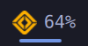
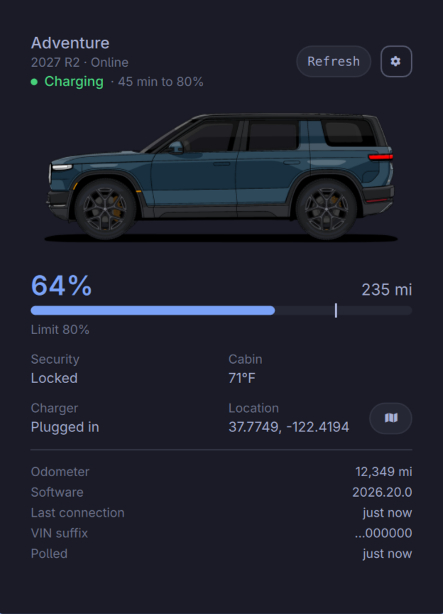

# OmaRivian

[](https://github.com/ttiimmaahh/omarivian/actions/workflows/ci.yml)
[](https://github.com/ttiimmaahh/omarivian/releases)

A read-only Rivian status widget for the Omarchy Quattro bar. Click the Rivian-inspired mark to see your vehicle's configured artwork, battery and range, charging, closures and locks, cabin climate, optional location, software, odometer, and last-contact information.

> [!WARNING]
> OmaRivian uses Rivian's private, unsupported owner API. It is not affiliated with or endorsed by Rivian and may stop working when that API changes. Although OmaRivian ships no vehicle-control operations, the account session it stores may have broader authority. Protect your desktop keyring accordingly.

## Project status

OmaRivian is an early-development `0.x` release. Expect continued testing and interface or API changes while marketplace verification and broader vehicle coverage progress.

R2 telemetry is validated against the maintainer's vehicle. The legacy R1 path is intentionally retained, but the maintainer does not own an R1 and cannot fully validate it firsthand. R1 owners are especially welcome to test the widget and report model/year, missing fields, or regressions through GitHub issues.

## Highlights

- Compact bar panel inspired by mobile vehicle widgets
- Automatically inherits the user's active Omarchy colors, typography, spacing, and display scaling
- Rivian-provided artwork matching the vehicle model, paint, wheels, and configuration
- Multiple-vehicle switcher
- Honest stale and offline states with last-known data
- Read-only request allowlist—no unlock, climate, charging, or wake commands
- Password and one-time code entered in a terminal, never in QML or process arguments
- Tokens stored in Linux Secret Service, not `shell.json` or plaintext files
- Location disabled by default and omitted entirely from the local state file

## Screenshots

### Bar widget

<p align="center">
  
</p>

The compact charge label is optional. Enable it through Omarchy's bar settings, or run:

```sh
omarchy bar set io.github.ttiimmaahh.omarivian showChargeInBar true --json
```

### Vehicle panel

<p align="center">
  
</p>

All visible identity, location, and telemetry values in these screenshots are synthetic demo data.

## Requirements

- Omarchy 4 with the Quattro shell
- Python 3.10+
- `secret-tool` from the `libsecret` package
- An unlocked Secret Service provider such as GNOME Keyring or KWallet
- A Rivian owner account with at least one vehicle

No Python packages are required; the helper uses only the standard library.

## Install

Install directly from GitHub:

```sh
omarchy plugin add https://github.com/ttiimmaahh/omarivian.git --enable
```

The widget defaults to the right side of the bar. Click its Rivian-inspired mark and choose **Link account**. OmaRivian opens a terminal for email, hidden password, and MFA input. The password and MFA code are never saved.

To run linking manually from the plugin directory:

```sh
./tools/omarivian link
```

## Usage

- **Left/right click:** open or close the panel
- **Middle click:** refresh status
- **R:** refresh while the panel is open
- **Escape:** close the panel
- **Tab / Shift-Tab:** switch between adjacent Omarchy panels

Use the in-panel vehicle pills to switch cars. The selected vehicle alone is refreshed, reducing calls to the unofficial API.

## Configuration

Configure the widget from Omarchy's bar settings, or set fields on its entry in `~/.config/omarchy/shell.json`:

| Setting | Default | Description |
| --- | ---: | --- |
| `refreshIntervalSec` | `900` | Refresh interval. Enforced minimum: 300 seconds. |
| `showChargeInBar` | `false` | Show battery percentage beside the car icon on horizontal bars. |
| `locationEnabled` | `false` | Include current coordinates in widget state and show the map action. |
| `unit` | automatic | `imperial`, `metric`, or blank for automatic. |

Location is sensitive and disabled by default, including after a clean installation. Enable it through Omarchy's bar settings, or run:

```sh
omarchy bar set io.github.ttiimmaahh.omarivian locationEnabled true --json
```

Press **Refresh** afterward to request the latest coordinates. When location is disabled, coordinates are not requested and are removed from `~/.local/state/omarivian/state.json`. When enabled, coordinates are sent to OpenStreetMap only if **Open in maps** is clicked. If the panel shows **Not reported**, Rivian did not provide a location during that refresh; a sleeping or offline vehicle may report it after reconnecting.

## Security and privacy

The QML panel invokes a narrow local helper. That helper contains only:

- Authentication operations required to establish a session
- `getUserInfo` to enumerate vehicles
- `GetVehicleState` to read an allowlisted set of legacy R1 status fields
- A bounded, read-only `ParallaxMessages` snapshot for missing R2 lock, closure, power-state, cabin-climate, and opt-in location fields
- `getVehicleImages` to discover Rivian's configured, display-only vehicle render

There is no generic query CLI and no vehicle command implementation. Session tokens are stored under the `omarivian` application label through Secret Service. When Rivian rejects an expired session, the next scheduled or manual refresh exchanges the stored refresh token, saves the rotated credentials immediately, and retries once; a separate background daemon is not required. Authenticated HTTP requests reject redirects and cross-origin responses, and network, keyring, state, and preference reads have strict byte limits.

The sanitized state cache is mode `0600` and contains vehicle status plus identity summaries; full VINs are never written. Vehicle artwork is downloaded only from Rivian-controlled HTTPS hosts into `~/.cache/omarivian/vehicle-artwork`, using mode `0700` directories and mode `0600` image files. QML loads the local file and never contacts Rivian directly. Unlinking removes that artwork cache.

OmaRivian does not collect analytics, operate a relay, or retain location history. Avoid posting state files or screenshots containing location information.

### Unlink and remove

**Unlink** in the panel requires confirmation and deletes the saved keyring session. You can also run:

```sh
./tools/omarivian unlink
omarchy plugin remove io.github.ttiimmaahh.omarivian
```

Removing the plugin does not automatically delete Secret Service entries or the local status cache; unlink first. To erase the non-secret cache afterward:

```sh
rm -rf "${XDG_STATE_HOME:-$HOME/.local/state}/omarivian" \
       "${XDG_CACHE_HOME:-$HOME/.cache}/omarivian"
```

## Development

### Omarchy scaling conventions

The shell derives typography and layout density from the user's theme and display preferences. QML contributions should:

- Use `Style.font.*` for text and icon sizes.
- Use `Style.space(...)` or semantic `Style.spacing.*` tokens for dimensions, margins, padding, gaps, controls, and hairlines.
- Use `Style.bar.*` for bar geometry and `fittedContentWidth` / `fittedContentHeight` for panels.
- Avoid manual device-pixel-ratio scaling and raw visual pixel sizes; reserve unscaled numbers for ratios, opacity, timing, and source-image crop fractions.

An importable, secret-free Postman collection and example environment for the same read-only API surface are in [`postman/`](postman/README.md). Rivian's private owner API uses its own GraphQL session/token flow rather than a documented OAuth 2.0 service.

GitHub Actions runs the Python and JavaScript tests plus Omarchy manifest validation and QML linting on every pull request, push to `main`, and release tag.

```sh
omarchy plugin validate .
qmllint -I "$OMARCHY_PATH/shell" BarWidget.qml Panel.qml
python3 -m unittest discover -s tests -p 'test_*.py'
node tests/model.test.js
```

For local shell testing, use the checkout helper. It validates the plugin, replaces an installed release with a symlink to this Git checkout, waits for Omarchy discovery, and enables it so saved source changes hot-reload:

```sh
./tools/local-plugin install
./tools/local-plugin status
```

Remove only the local symlink, or replace it with a clean clone pinned to the latest stable release tag:

```sh
./tools/local-plugin uninstall
./tools/local-plugin release
# Or validate a specific release:
./tools/local-plugin release v0.2.0
```

Switching modes preserves Secret Service credentials and cached state. Use the panel's **Unlink** action separately only when intentionally testing clean account onboarding.

## Credits

The API behavior was independently implemented using public, unofficial community references including [`rivian-python-client`](https://github.com/bretterer/rivian-python-client) (MIT) and [Riviamigo](https://github.com/bballdavis/Riviamigo) (GPL-3.0) as documentation. No source from Riviamigo is included in this repository.

## License

MIT. See [LICENSE](LICENSE).
